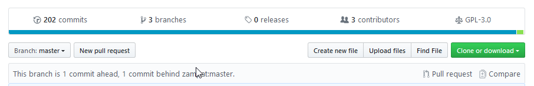
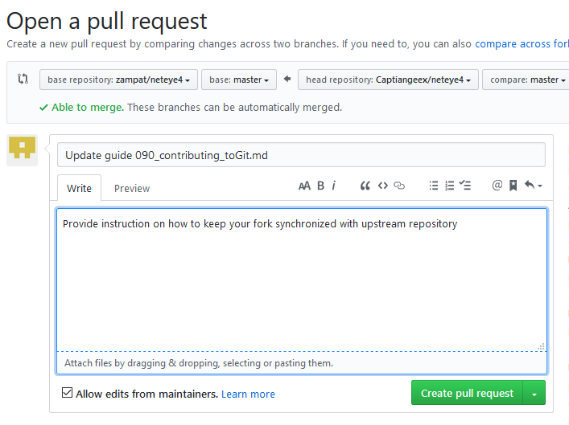

# Contributing to this repository

__General Info:__ Updates to files provided this or external repositories should always be promoted as pull requests. According the community culture this facilitates the integration and helps to keep track of the incremental improvements.

__Overview:__
1. Requirements
2. Fork of repo
3. Contribute improvements
4. Commit changes
5. Create pull request
6. Stay synchronized with this repo

#### 1. Requirements

[Sign up to github or login](https://github.com/join)

#### 2. Fork of repo

Fork the present repository to your own repository. A 1:1 copy of the entire content is created as copy under your account. 

#### 3. Contribute improvements 

Add your contributions by adding / editing files. You can perform this step via web-ui, in the same moment you can check-out (clone) your forked repository to your local system. [Fork repo to local system and create pull request (guide for linux)](https://help.github.com/en/articles/fork-a-repo)


#### 4. Commit changes

When working on web each upload or edit of a file is terminated by commit. When working on command line on linux your can commit changes via:
```
git status
git add <changed_file>
git commit -m "description of improvement"
git push
```
[More examples in this simple how-to](https://help.github.com/en/articles/adding-a-file-to-a-repository-using-the-command-line)

#### 5. Create pull request

On web-ui perform a "new pull request":

 
Place a meaningful title and description:



#### 6. Stay synchronized with this repo
Once pull request has been submitted you might delete your fork to fork it at a later moment from the latest commit level.
As alternative you need to keep you fork synchronized with main repository of neteye4. Unfortunately this can not be done via simple click on web-ui, but you need to synchronize all upstream changes as "Pull request" into your fork. [Read here how to keep my fork in sync](https://stackoverflow.com/questions/20984802/how-can-i-keep-my-fork-in-sync-without-adding-a-separate-remote/21131381#21131381)

For users of git via command line on Linux things are simple and [documented here](https://help.github.com/en/articles/syncing-a-fork)
