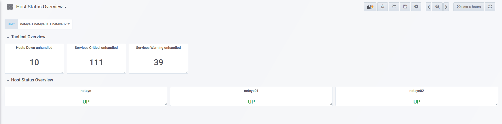

# Provide NetEye 3 monitoring data in Analytics dashboard 

**Note:** This procedure is only compatible with NetEye 3, because based on Thruk Json export

**Prerequisite:** The installation of the streaming infrastructure from "neteye_nats_collector"

## Configuration

Enable input Http-Json reader (i.e. NetEye 3 Monitoring status from Thruk via Json)
- HTTP collector for Service Details
- HTTP collector for Tactical Overview

Note: We lower the default frequency in order to avoid an overload of the json-source 

### Configure collector for Service Details

- Copy a new telegraf configuration to run collection as separate instance
- Patch configuration to define: frequency, destination database, destination measurement
- Define an init start/stop mechanism. In case of cluster put in /etc/sysconfig/neteye-extra-services

```
# cp /etc/nagios/neteye/telegraf/sample_telegraf.conf.tpl /etc/nagios/neteye/telegraf/telegraf_monitoring_service_detail.conf
# patch /etc/nagios/neteye/telegraf/telegraf_monitoring_service_detail.conf < ./neteye4_monitoring_share/itoa/neteye_monitoring_status_collector/telegraf_inputsThrukServiceDetail.conf.diff
patching file /etc/nagios/neteye/telegraf/telegraf_monitoring_service_detail.conf
# cp /etc/init.d/telegraf /etc/init.d/telegraf_monitoring_service_detail
```

Start and register telegraf collector service
```
# /etc/init.d/telegraf_monitoring_service_detail start
# chkconfig --add telegraf_monitoring_service_detail
# chkconfig --list telegraf_monitoring_service_detail
telegraf_monitoring_service_detail      0:off   1:off   2:on    3:on    4:on    5:on    6:off
```

### Configure collector for Tactical Overview

- Copy a new telegraf configuration to run collection as separate instance
- Patch configuration to define: frequency, destination database, destination measurement
- Define an init start/stop mechanism. In case of cluster put in /etc/sysconfig/neteye-extra-services

```
# cp /etc/nagios/neteye/telegraf/ sample_telegraf.conf.tpl /etc/nagios/neteye/telegraf/telegraf_monitoring_tactical_overview.conf
# patch /etc/nagios/neteye/telegraf/telegraf_monitoring_tactical_overview.conf < ./neteye4_monitoring_share/itoa/neteye_monitoring_status_collector/telegraf_inputsThrukTacticalOverview.conf.diff
cp /etc/init.d/telegraf /etc/init.d/telegraf_monitoring_tactical_overview

# /etc/init.d/telegraf_monitoring_tactical_overview start
# chkconfig --add telegraf_monitoring_tactical_overview
# chkconfig --list telegraf_monitoring_tactical_overview
telegraf_monitoring_tactical_overview   0:off   1:off   2:on    3:on    4:on    5:on    6:off
```

## Dashboarding of Monitoring data

Here I provide a sample dashboard providing data from both measurements:
- tactical overview
- host/service details

Import provided .json file in Grafana (5.x or later) to obtain the following dashboard:

!


