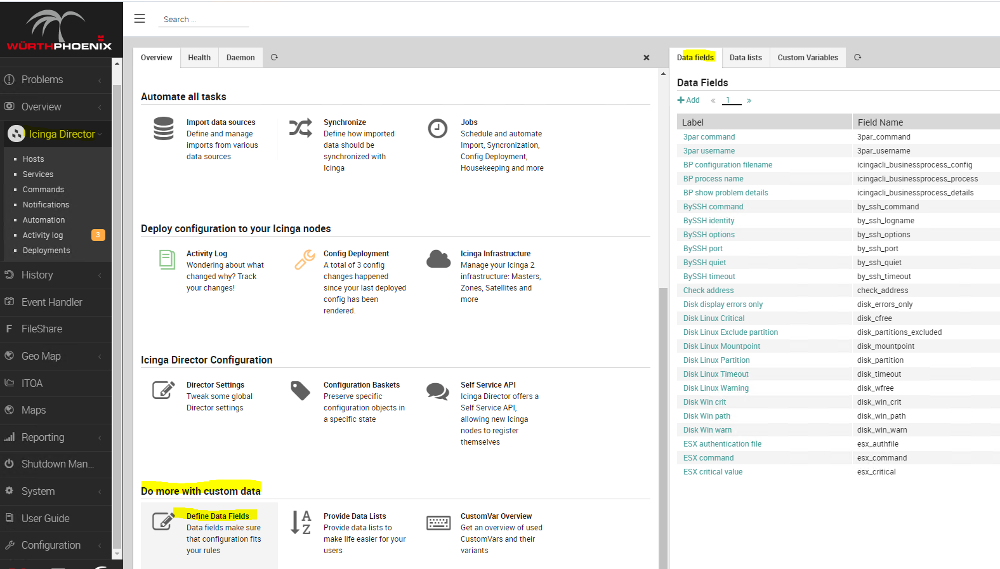
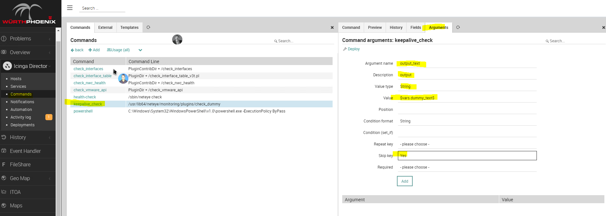
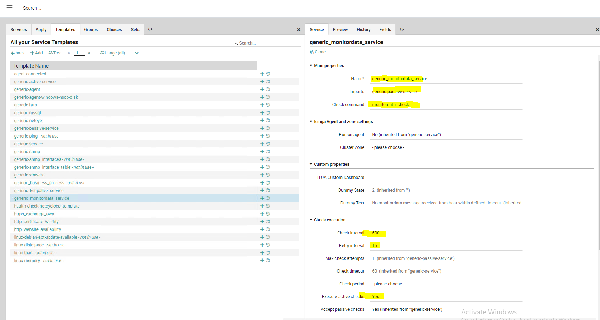

### Prerequisites

1. Neteye 4.16
2. setup and configured Nats service on Neteye
3. setup and configured Tornado service , Tornado nats collector services and Tornado UI on neteye master
4. installed AX Etw Traxing and SQLDMV Monitor  version 0.5 or higher
5. installed and configured Zampat repository (please refer to <https://github.com/zampat/neteye4/blob/master/doc/050_community_configs_init.md>) on the neteye master

>Zampat repository is required as configuration is based on the Host template generic-passive-host and Service template generic-passive-service

### Tornado Nats Collector Service

Define topic name to use for nats communication

<agent_monitor_alive.topic> = name which must be configured on nats.server and on axetwtracing and sqldmvmonitor config files.

### Icinga Directory Objects for EndPoint monitor

Configuration of neteye Icinga Directory Objects for EndPoint monitor



1. Create Data Fields (dummy_text and dummy_state)


```
dummy_text :
Fieldname : dummy_text
Caption : Dummy Text
Data Type: String
Visibility: Visible

dummy_state :
Fieldname : dummy_state
Caption : Dummy State
Data Type: Number
```

#### Command creation

##### keepalive_check:


```
Command type: Plugin Check Command
Command name: keepalive_check
Command: /usr/lib64/neteye/monitoring/plugins/check_dummy
Timeout :60
```
```
Dummy State: 2
Dummy Text: No keepalive message received from host within defined timeout
```


```
Argument name: state
Description : state
Value Type: String
Value: $dummy_state$
Position: 1
```



```
Argument name: output_text
Description : output
Value Type: String
Value: $dummy_text$
Position: 2
``` 

##### monitordata_check

```
  Command type: Plugin Check Command
  Command name: monitordata_check
  Command: /usr/lib64/neteye/monitoring/plugins/check_dummy
  Timeout :60
```
```
  Dummy State: 2
  Dummy Text : No monitordata message received from host within defined timeout
```


```
Argument name: state
Description : state
Value Type: String
Value: $dummy_state$
Position: 1
```


```
Argument name: output_text
Description : output
Value Type: String
Value: $dummy_text$
Position: 2
``` 

#### Create Service templates

##### generic_keepalive_service


```
Main properties
  Name : generic_keepalive_service
  imports: generic-passive-service
  Check command: keepalive_check
```
```
Check execution
  check_interval = 1m
  retry_interval = 15s
  enable_active_checks = yes
```

##### generic_monitordata_service



```
Main properties
  Name : generic_monitordata_service
  Imports : generic-passive-service
  Check command: keepalive_check
```
```
Check execution
  check_interval : 10m  
  retry_interval : 15s
  enable_active_checks : yes
```

### Configuration of nats user and permissions

Define permission for ax and sql agents on nats server

create conf file *agents-nats-json-publisher.conf* in */neteye/shared/nats-server/conf/permissions.d*

```
  AGENT_MONITOR_ALIVE_METRICS = 
  {
    publish = "tornado_nats_json.>"
  }
```

Define user for ax and sql agents on nats server
create conf file *\<user\>.conf* in */neteye/shared/nats-server/conf/users.d*

```
  {
    user: "agents.pele.dev", 
    permissions: $AGENT_MONITOR_ALIVE_METRICS
  }
```

### Configuration of tornado\_nats\_json\_collector service

#### Topics definition

The nats\_json\_collector service listens only to events of defined topics: create *\<agent\_monitor\_alive\.topic\>\.json* files in */neteye/shared/tornado\_nats\_json\_collector/topics* with the following syntax

```
  {
    "nats_topics": [<agent_monitor_alive.topic>],
    "collector_config": {
      "event_type": "${event_type}",
      "payload": {
        "header": "${header}",
        "body": "${body}"
      }
    }
  }
```

>*collector_config* defines inner transformation rules from agents'messages to tornado messages and cannot be modified

#### Permissions on topic files

```
Chown tornado <topic>.json
Chgrp tornado <topic>.json
Chmod g+r-x <topic>.json
Chmod +rw <topic>.json
Chmod o-xrw <topic>.json
```

>*tornado* group must have read rights on file *\<agent\_monitor\_alive\.topic\>\.json*

#### 

Restart and test status of nats\_json\_collector service

```
systemctl restart tornado_nats_json_collector.service
systemctl status tornado_nats_json_collector.service
```

### Configuration of Tornado rules and filters for Agents using Tornado UI

Adding filter for <itoafilter> and new ruleset <create_and_process_events>
  


```
{
  "description": "filters all events of type \"monitoring.events.message\"",
  "active": true,
  "filter": {
    "type": "AND",
    "operators": [
      {
        "type": "equals",
        "first": "${event.type}",
        "second": "monitoring.events.keepalive"
      }
    ]
  }
}
```


Add Rule keepalive

>Name: keepalive  
>position: 1  
>description: keepalive message  
>active: true  
>continue after: true  

```
where:
{
  "type": "AND",
  "operators": [
    {
      "type": "equals",
      "first": "${event.payload.header.id}",
      "second": 1
    }
  ]
}

with:
{
  "instance": {
    "from": "${event.payload.header.instance}",
    "regex": {
      "type": "Regex",
      "match": "(\\$.+)*$",
      "group_match_idx": 0,
      "all_matches": false
    },
    "modifiers_post": [
      {
        "type": "ReplaceAll",
        "find": "$",
        "replace": "",
        "is_regex": false
      }
    ]
  }
}

action:
[
  {
    "id": "smart_monitoring_check_result",
    "payload": {
      "action_name": "create_and_or_process_service_passive_check_result",
      "check_result": {
        "exit_status": "0",
        "plugin_output": "message received from ${event.payload.header.instance} ${event.payload.header.description}",
        "service": "${event.payload.header.host}!${event.payload.header.instance} keepalive",
        "type": "Service"
      },
      "host": {
        "address": "${event.payload.header.host}",
        "imports": "generic-passive-host",
        "object_name": "${event.payload.header.host}",
        "object_type": "Object",
        "vars": {
          "created_by": "tornado",
          "rulename": "monitoring.events.keepalive"
        }
      },
      "service": {
        "host": "${event.payload.header.host}",
        "imports": "generic_keepalive_service",
        "object_name": "${event.payload.header.instance} keepalive",
        "object_type": "Object",
        "vars": {
          "agentname": "${event.payload.header.agent}",
          "created_by": "tornado",
          "datasource": "${event.payload.header.details.datasource}",
          "instancename": "${_variables.instance}",
          "rulename": "monitoring.events.keepalive",
          "version": "${event.payload.header.details.major}.${event.payload.header.details.minor}.${event.payload.header.details.build}"
        }
      }
    }
  }
]
```

Add Rule monitordata

>Name: monitordata  
>position: 2  
>description: monitordata message  
>active: true  
>continue after: true  

```
where:
{
  "type": "AND",
  "operators": [
    {
      "type": "equals",
      "first": "${event.payload.header.id}",
      "second": 2
    }
  ]
}

with:
{
  "instance": {
    "from": "${event.payload.header.instance}",
    "regex": {
      "type": "Regex",
      "match": "(\\$.+)*$",
      "group_match_idx": 0,
      "all_matches": false
    },
    "modifiers_post": [
      {
        "type": "ReplaceAll",
        "find": "$",
        "replace": "",
        "is_regex": false
      }
    ]
  }
}

action:
[
  {
    "id": "smart_monitoring_check_result",
    "payload": {
      "action_name": "create_and_or_process_service_passive_check_result",
      "check_result": {
        "exit_status": "${event.payload.body.exit_status}",
        "performance_data": "${event.payload.body.performance_data}",
        "plugin_output": "message received from ${event.payload.header.instance} ${event.payload.header.description}",
        "service": "${event.payload.header.host}!${event.payload.header.instance} monitordata",
        "type": "Service"
      },
      "host": {
        "address": "${event.payload.header.host}",
        "imports": "generic-passive-host",
        "object_name": "${event.payload.header.host}",
        "object_type": "Object",
        "vars": {
          "created_by": "tornado",
          "rulename": "monitoring.events.monitordata"
        }
      },
      "service": {
        "host": "${event.payload.header.host}",
        "imports": "generic_monitordata_service",
        "object_name": "${event.payload.header.instance} monitordata",
        "object_type": "Object",
        "vars": {
          "agentname": "${event.payload.header.agent}",
          "created_by": "tornado",
          "instancename": "${_variables.instance}",
          "rulename": "monitoring.events.monitordata"
        }
      }
    }
  }
]
```
