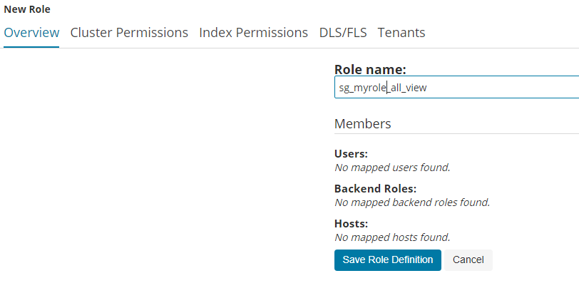
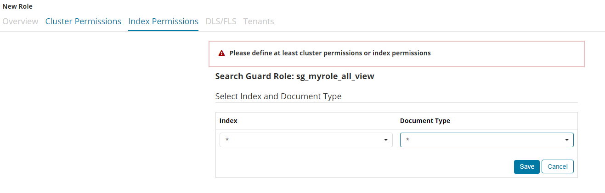
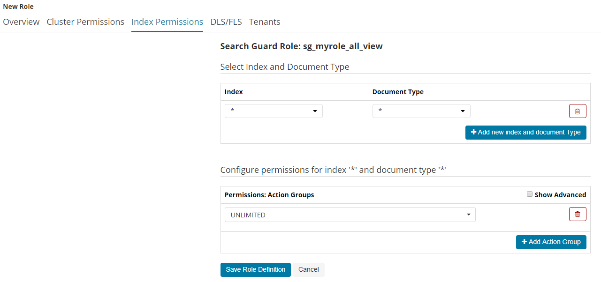
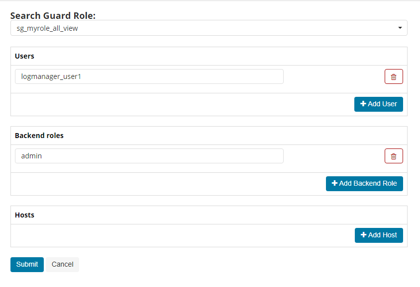
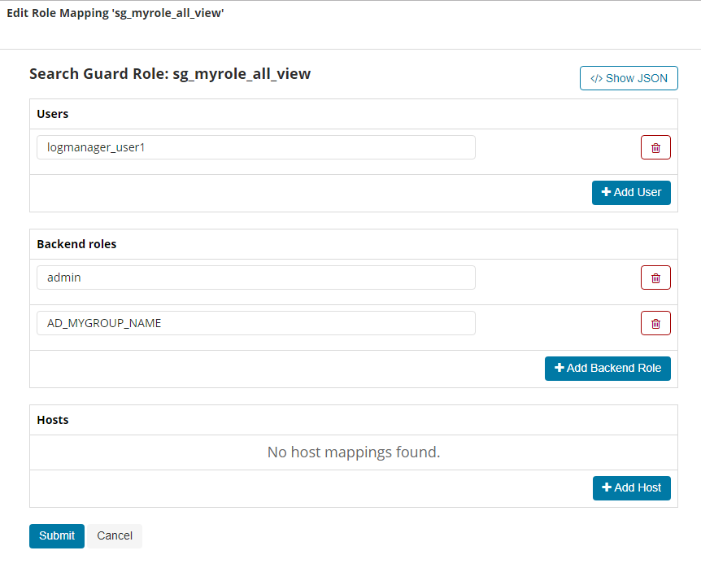

 

# Introductive documentation

Unserstanding of Roles, Backend Roles of Searchguard
https://docs.search-guard.com/latest/active-directory-ldap-connection

Configuration of AD Authentication Backend
https://docs.search-guard.com/latest/active-directory-ldap-authentication

## Backup you configuration
Get familiar with the usage of "sgadmin"

https://docs.search-guard.com/latest/sgadmin

and Backup your current search-guard configuration:

https://docs.search-guard.com/latest/configuration-production#configuratin-backup-and-restore

Sample command call for NetEye to export all active configurations into a local folder:

export ES_PATH_CONF=/neteye/local/elasticsearch/conf/
export CERT_PATH=$ES_PATH_CONF/certs/

/bin/bash /usr/share/elasticsearch/plugins/search-guard-6/tools/sgadmin.sh -r  -icl -nhnv -cacert $CERT_PATH/root-ca.crt -cert $CERT_PATH/admin.crt.pem -key $CERT_PATH/private/admin.key.pem

## Authentication via LDAP
Setup the AD Authentication backend
Define within the sg_configuration yml (File of Type config) in section authc the definition ldap
Make use of SG Configuration tempalte file you can get from git community repo: sg_config_sample.yml
https://github.com/zampat/neteye4_monitoring_share/tree/master/logmanager/searchguard
Modify your sg_config* retrieved from above backup procedure and push new configuration to search-guard

export ES_PATH_CONF=/neteye/local/elasticsearch/conf/
export CERT_PATH=$ES_PATH_CONF/certs/

/bin/bash /usr/share/elasticsearch/plugins/search-guard-6/tools/sgadmin.sh -f sg_config_<year_month_day>.yml -t config -icl -nhnv -cacert $CERT_PATH/root-ca.crt -cert $CERT_PATH/admin.crt.pem -key $CERT_PATH/private/admin.key.pem

## LDAP user authentication and role assignment

Define a Role

Assign Index Permissions
1. Define Index and Document type

2. Assign permission to Index permission

Assign optional Cluster Permissions
NB: You can find this sample role as yml export in community git repo: sg_roles_sample.yml
https://github.com/zampat/neteye4_monitoring_share/tree/master/logmanager/searchguard

Sample sgadmin call to import new roles definitions:
NB: Remember - all existing Roles will be replaced

/bin/bash /usr/share/elasticsearch/plugins/search-guard-6/tools/sgadmin.sh -f sg_roles_2019-Jan-29_15-10-48.yml -t roles -icl -nhnv -cacert $CERT_PATH/root-ca.crt -cert $CERT_PATH/admin.crt.pem -key $CERT_PATH/private/admin.key.pem

## Role Mapping
Map Permissions of Role to Users
Define Role Mapping for

searchguard role (choose from selection box)
assign a user name for login (LDAP user or local user)
assign a backen role (https://docs.search-guard.com/latest/mapping-users-roles#backend-roles-and-search-guard-roles )

Map Permissions of Role to AD Groups
Preparative Setup

Define a authz definition for mapping LDAP Groups to Backend Roles. 
NB: Make use of SG Configuration tempalte file you can get from git community repo: sg_config_sample.yml

Define a Role mapping as above

Specify as Backend Role the name of the LDAP Group. Members of those group will recieve permissions associated to defined sg role.

NB: You can find this sample role mapping as yml export in community git repo: sg_roles_mapping_sample.yml
https://github.com/zampat/neteye4_monitoring_share/tree/master/logmanager/searchguard

Sample sgadmin call to import new rolesmapping definitions:
NB: Remember - all existing Role-Mappings will be replaced

/bin/bash /usr/share/elasticsearch/plugins/search-guard-6/tools/sgadmin.sh -f sg_roles_mapping_2019-Jan-29_15-10-48.yml -t rolesmapping -icl -nhnv -cacert $CERT_PATH/root-ca.crt -cert $CERT_PATH/admin.crt.pem -key $CERT_PATH/private/admin.key.pem

