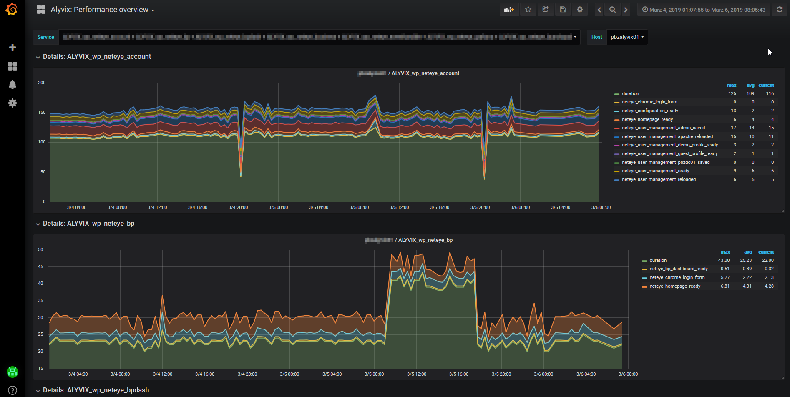
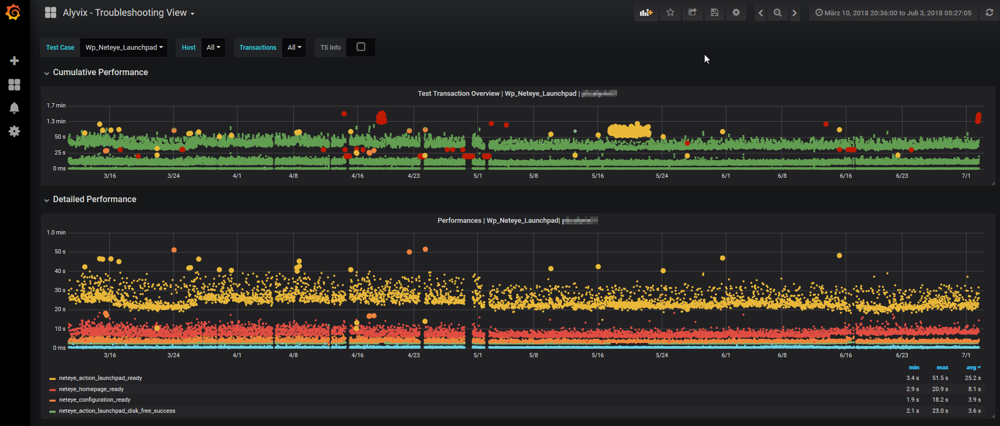

# Alyvix ITOA Dashboards

## Alyvix Performance Overview

Provides a selection of all Alyvix services and related hosts and allows to compare same testcases with performance data collected from various alyvix installations
- Select Service
- For each Host a column is added

Setup: [Import Alyvix_ Performance overview_neteye3.json into NetEye ITOA/Grafana.](Alyvix_ Performance overview_neteye3.json)

Preview:

# Alyvix measurement Performance comparison

Import file for NetEye 3: [Alyvix_ Performance comparison_neteye3.json](Alyvix_ Performance comparison_neteye3.json)
!

## Alyvix Troubleshooting view

Provides a detailed view of performance data from Alyvix collected via ITOA streaming architecture. [For setup see ITOA](../../../itoa/).
For each selected testcase a details view (with dots indicating the timestamp) is shown. For each available collector Alyvix, an additional column is shown.

Setup: 
- Import alyvix_troubleshooting_view.json into NetEye ITOA/Grafana.
- Setup the ITOA streaming architecture on NetEye (itoa -> neteye_nats_collector)
- Send Alyvix perfdata to NetEye via streaming protocol with keyword ["Publish Perfdata"](https://alyvix.com/doc/test_case_building/system_keywords.html#publish-perfdata)

Preview:
