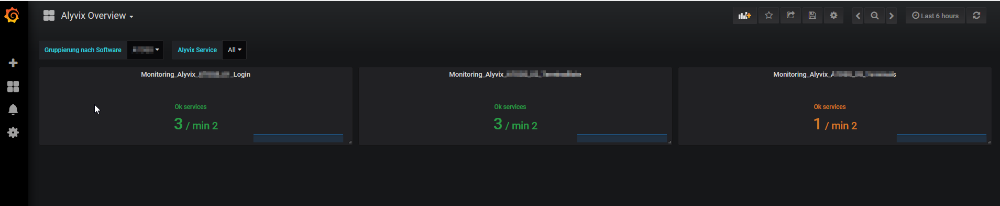

# Business Logic Enhancements

## Monitoring status aggregation

Enhancement to aggregate the monitoring status of multiple service checks with the same service name. This allows you to aggregate the monitoring states of the same context, ie. check of Alyvix testcase, SQL server status, etc.
(The usecase has been ontroduced on my blog article.](./check_service_aggregator_blog.md)

### Configuration for NetEye 3

1. Place Plugin in folder: /usr/lib64/nagios/plugins/local
2. Import [Monarch Profile: ](./service-profile-monitoring_status_aggregation.xml) 
3. Define services to aggregate using parameter -s <servicename>

### Dashboarding 

The presentation of the aggregated information could be shown according the count of OK services with the provided sample dashboard.

[Import dashboard for NetEye 3: status_overview_neteye3.json](status_overview_neteye3.json)

#### Dashboarding for Alyvix

[See chapter dashboards for alyvix](../analytics_dashboards/alyvix)
