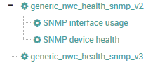

# Check NWC health for NetEye 4

## Importing Service Templates

Execute: `service_template-nwc_health.sh`:
It creates the following templates: 


## Setup and configuration 

`neteye4_path: /neteye/local/monitoring/plugins`

For Neteye 4 the plugins is installed within its path by running the install script of the neteye share project. 

Cache Paths to create:
- NetEye 4:
  make cache files cluster compatible: `/neteye/local/monitoring/cache/check_nwc_health`
- NetEye 3:
  make cache files cluster compatible: `/var/cache/nagios`


## Compiling of script:

```
Compiling for NetEye 4:
./configure --prefix=/neteye/local/monitoring/plugins --with-nagios-user=icinga --with-nagios-group=icinga --with-perl=/usr/bin/perl --with-statefiles-dir=/neteye/local/monitoring/cache/check_nwc_health

Compiling for NetEye 3:
./configure --prefix=/usr/lib64/nagios/plugins --with-nagios-user=nagios --with-nagios-group=nagios --with-perl=/usr/bin/perl --with-statefiles-dir=/var/cache/nagios
```

