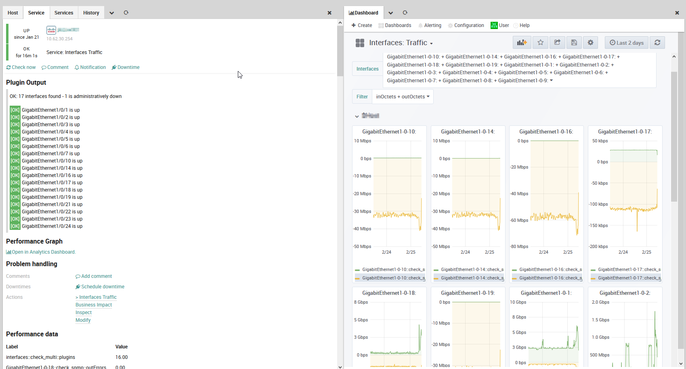

# check_interfaces: efficient check for network traffic monitoring

### Introduction of Check:
https://blog.netways.de/2011/07/18/switch-monitoring-via-snmp/

## Implementing in NetEye 4
- Monitoring Service template:
[Provided and installed by default icinga2-monitoring-templates. File: `1101a-st_snmp_network_traffic.sh` ](https://github.com/zampat/icinga2-monitoring-templates)
- Install Analytics Dashboard
Provided by File: `interfaces_traffic.json`
Dashboard provided looks like:

- A custom field on service template redirects to this dashboard


## Repositoring and compiling check

Git Repository:
https://github.com/NETWAYS/check_interfaces

Prerequisites for compiling on NetEye / RHEL7:
Install the following packages:
- `gcc`
- `net-snmp-devel`

On RHEL8 install "Development Tools"
`dnf group install "Development Tools"`

In configure.ac adjust some version requiremnets:
```
AC_PREREQ([2.69])
AC_INIT([check_interfaces],[1.4])
AC_PREFIX_DEFAULT(/usr/local/nagios)
AC_PROG_CC()
AC_PROG_INSTALL()

AM_INIT_AUTOMAKE([1.16.1])
```


Compile commands as indicated on git
```
./configure
make
```

## Example Use:
```
[root@neteye4]# ./check_interfaces -c community -h 10.10.10.10 -r '^GigabitEthernet1/0/.*' -R '^GigabitEthernet1/0/(8|9|11|12|13|15|20)'
OK: 17 interfaces found - 1 is administratively down | interfaces::check_multi::plugins=16 time=2.64 device::check_snmp::uptime=4722468s GigabitEthernet1-0-1::check_snmp::inOctets=141845681634101c outOctets=43560097564560c inDiscards=0c outDiscards=722138746c inErrors=0c outErrors=0c... 
[OK] GigabitEthernet1/0/1 is up
...
[OK] GigabitEthernet1/0/24 is up
```
