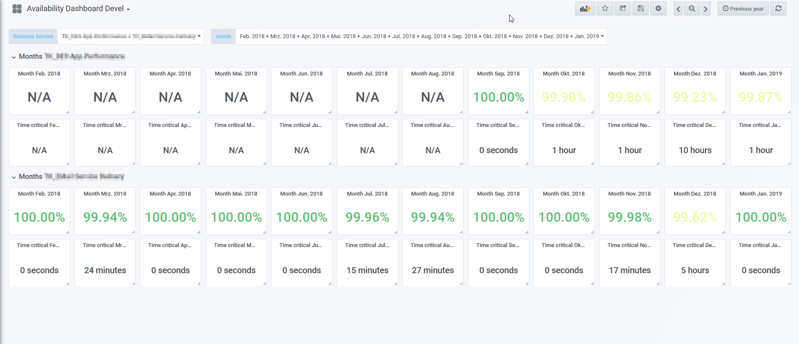

# Availability Overview 

Dashboard based on pre-calculated availability data of NetEye 3.
Availability data is shown on month base for selected business services.

Months are provided as variable with key/value pair: The value is included as part of the where condition.

Sample preview of dashboard:
!

### Advice

Preview release: Dashboard is still under development.

Installation:
Import dashboard file .json to Grafana
